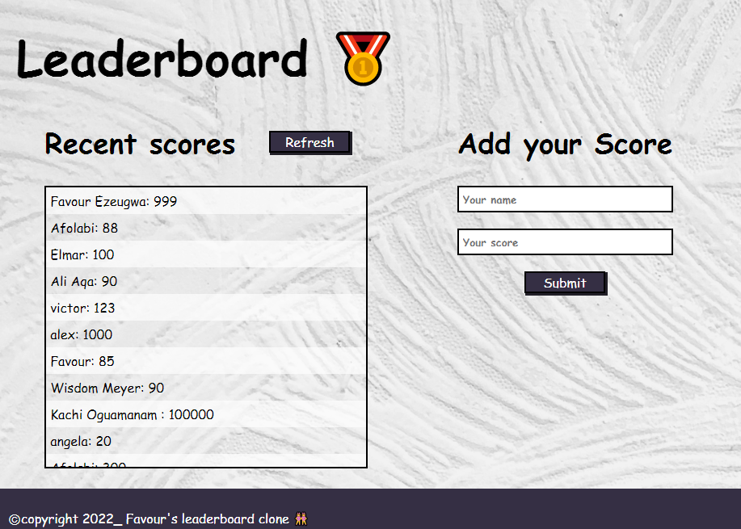

# Leaderboard\_

> The leaderboard website displays scores submitted by different players. It also allows you to submit your score. All data is preserved in the external Leaderboard API service.

> The Leaderboard API is connected in order to implement the actions behind the "Refresh" and "Submit" buttons. In the last step, async & await is used to send and receive data from API.

## Built With

- Webpack, and served by a Webpack dev server
- JavaScript(ES6 async/await)
- HTML/CSS
- Gitflow
- API
- Media query

## Screenshot




## Live Demo

[link to live demo](https://favourezeugwa.github.io/Leaderboard_/)


## Getting Started

### Clone this repository

```
git bash
$ git clone git@github.com:Favourezeugwa/Leaderboard_.git
$ cd Leaderboard_
$ code .
```

### Run project

```
VS-code terminal
$ npm install
$ npm run build
$ npm run start # this will enable webpack to watch for your changes in code
```

### Open page in browser

```
VS-code terminal
$ open dist/index.html
```

## Author

👤 **Favour Amarachi Ezeugwa**

- GitHub: [@Favourezeugwa](https://github.com/Favourezeugwa)
- LinkedIn: [Favour Amarachi Ezeugwa](https://www.linkedin.com/in/favour-amarachi-ezeugwa-a5bb31149/)
- Twitter:[@Favour_ezeugwa](https://twitter.com/Favour_ezeugwa)

## 🤝 Contributing

Contributions, issues, and feature requests are welcome!
Feel free to check the [issues page](https://github.com/Favourezeugwa/Leaderboard_/issues)

## Show your support

Give a ⭐️ if you like this project!

## Acknowledgments

- Inspiration(Microverse leaderboard wireframe)
- Microverse student community

## 📝 License

This project is [MIT](./MIT.md) licensed.
